  

<h3 align="center">A traveller in AI: I dug to the core of models, then out through the machines that hold it up.</h3>

  Senior HPC Systems Engineer → AI Infrastructure &amp; LLMOps · Alexandria, Egypt 
  <a href="https://www.linkedin.com/in/ahmedyousrisobhi/">LinkedIn</a> ·
  <a href="mailto:ahmedyousrisobhi@gmail.com">Email</a> ·
  <a href="https://leetcode.com/ahmedyousrisobhi/">LeetCode</a>

  

<h3 align="center">🏆 Treasures found along the way</h3>

<table align="center">
  <tr>
    <td align="center" width="25%"><h2>1,500+</h2>GPU nodes under watch</td>
    <td align="center" width="25%"><h2>60</h2>SuperPod nodes, solo</td>
    <td align="center" width="25%"><h2>99%+</h2>availability, 24/7</td>
    <td align="center" width="25%"><h2>5+ yrs</h2>from data to data center</td>
  </tr>
</table>

  <b>🎒 In my pack:</b> SLURM · Kubernetes · NVIDIA BCM · DeepSpeed · FSDP · PyTorch · DDN Lustre · Ollama · Python

  <b>🗺️ Here be LLMOps:</b> now forging a local RAG pipeline and writing <a href="https://github.com/AhmedYousriSobhi/aCupOfTea">aCupOfTea</a>, a traveller's guide to LLM inference. 
  <b>Seeking fellow travellers:</b> open to AI infrastructure and LLMOps roles, remote or hybrid.

 

<b>📜 Read the full chronicle</b>

 

| | Stop | What I did there |
|---|---|---|
| ⛰️ | **Alexandria University** · 2019 | Electrical engineering: where the road began, at the silicon |
| 🔥 | **ITI & Tekomoro** · 2021 | AI program, then 3D perception from stereo cameras (pseudo-LiDAR, KITTI) |
| 🟡 | **elmenus** · 2022 | Forecast a city's hunger hour by hour: 82% accuracy, 10% better delivery-time estimates |
| 🟡 | **Omdena** · 2023 | Face & emotion models for children's well-being; forecasts for extreme weather |
| 🔥 | **KAUST** · 2023 | Kept researchers' runs alive: DeepSpeed ZeRO, FSDP, self-hosted LLM inference |
| 🏰 | **ESPRIT** · 2024 | Raised a DGX A100 cluster from bare metal and handed over the keys |
| 🏰 | **SDAIA** · 2025 | Sole warden of a 60-node DGX H100 SuperPod: SLURM, Kubernetes, Lustre |
| ⛰️ | **Core42 (G42)** · now | 1,500+ GPU nodes across five fleets: H100, H200, MI210, DGX/HGX |

⛰️ silicon · 🏰 clusters · 🔥 training · 🟡 the core &nbsp;|&nbsp; MSc Computer & Systems Engineering, Ain Shams University (in progress)

