  

<h3 align="center">Every level added a layer of the AI stack. Next class: Solutions Architect.</h3>

  

  🤝 <b>Looking for a party?</b> Open to AI infrastructure and solutions architect roles, remote or hybrid. 
  <a href="https://www.linkedin.com/in/ahmedyousrisobhi/">LinkedIn</a> ·
  <a href="mailto:ahmedyousrisobhi@gmail.com">Email</a> ·
  <a href="https://leetcode.com/ahmedyousrisobhi/">LeetCode</a> ·
  <a href="https://github.com/AhmedYousriSobhi/aCupOfTea">aCupOfTea ☕</a>

<b>📜 Quest log</b>

 

| Lv | Quest | Reward |
|---|---|---|
| 1 | **Alexandria University** · 2019 | Electrical engineering: learned the silicon before the models |
| 2 | **elmenus** · 2022 | Hourly demand forecasting at 82% accuracy; 10% better delivery-time estimates |
| 3 | **Omdena** · 2023 | Face & emotion models for children's well-being; extreme-weather forecasting |
| 4 | **KAUST** · 2023 | Kept researchers' GPU runs alive; validated DeepSpeed ZeRO & FSDP; self-hosted LLM inference |
| 4 | **ESPRIT** · 2024 | Built a DGX A100 cluster from bare metal, validated with HPL and network benchmarks |
| 5 | **SDAIA** · 2025 | Sole technical owner of a 60-node DGX H100 SuperPod at 99%+ availability |
| 5 | **Core42 (G42)** · now | 1,500+ GPU nodes across five fleets: H100, H200, MI210, DGX/HGX |

Training arc: ITI's 9-month AI program and 3D perception at Tekomoro (2021) · MSc in Computer & Systems Engineering, Ain Shams University (in progress)

